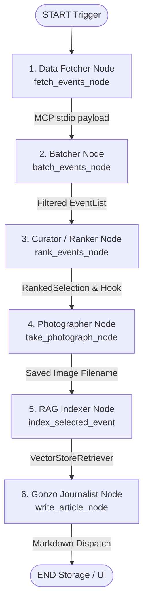

# 🕶️ AGENTS.md — Chrono S. Thompson Multi-Agent Architecture

> **Portfolio Specification** — Detailed technical documentation of the multi-agent system, state transitions, MCP contracts, and prompt engineering protocols driving **Chrono S. Thompson: The Gonzo Historical Correspondent**, built with **LangGraph** and managed with **`uv`**.

---

## 🧭 Executive Overview

Chrono S. Thompson is an autonomous agentic pipeline designed to bridge the temporal disconnect between historical records and contemporary engagement. Instead of treating historical archives as static encyclopedic entries, the architecture orchestrates a stateful multi-step workflow that:

1. **Fetches historical data** via an isolated Model Context Protocol (**FastMCP**) server using `stdio` transport.
2. **Batches & cleans raw events** using LLM structured outputs (Pydantic `EventList`).
3. **Performs editorial curation** using deterministic structured outputs (Pydantic `RankedSelection`), identifying chaotic narrative friction.
4. **Synthesizes visual illustrations** by generating prompt-tailored historical photographs stored in `storage/images/`.
5. **Performs RAG context indexing** by scraping full Wikipedia content and creating an in-memory `VectorStoreRetriever`.
6. **Drafts high-engagement prose** in the visceral voice of Gonzo journalism (Hunter S. Thompson inspired).
7. **Persists and archives** daily dispatches automatically as Markdown files in `storage/output/`.

---

## 📐 Pipeline & State Graph Flow



---

## 📦 Global Shared State (`ChronoState`)

State transitions are strictly typed in `src/chrono_s_thompson/core/state.py` to enforce zero runtime drift and seamless validation across nodes.

| Attribute | Type | Description |
|---|---|---|
| `target_date` | `str` | Calendar date target in `MM/DD` format. |
| `raw_events` | `List[HistoricalEvent]` | Normalized raw events payload returned by the FastMCP tool. |
| `batched_events` | `EventList` | LLM-filtered structured collection of historical events. |
| `curated_story` | `Optional[RankedSelection]` | Pydantic model representing the selected event and Gonzo hook. |
| `detailed_event` | `Optional[DetailedEvent]` | In-depth historical event details when queried. |
| `filename` | `Optional[str]` | Local filename of the generated photograph image (`storage/images/`). |
| `custom_event` | `Optional[HistoricalEvent]` | User-selected historical event from Streamlit UI override. |
| `retriever` | `Optional[VectorStoreRetriever]` | In-memory vector store retriever built from scraped Wikipedia content. |
| `final_article` | `Optional[str]` | Complete Gonzo article formatted in Markdown. |
| `published_path` | `Optional[str]` | Filesystem path of the persisted dispatch (`storage/output/{date}_{title}.md`). |

---

## 🤖 Detailed Agent & Node Specifications

### 1. Data Fetcher Node (`src/chrono_s_thompson/graph/nodes/fetcher.py`)
* **Role:** Subprocess I/O & MCP Tool Orchestration.
* **Mechanism:** Interacts with the local `FastMCP` server over standard I/O (`stdio`), invoking the `get_historical_events` tool.
* **Input State:** `target_date`
* **Output State Mutation:** `{"raw_events": List[HistoricalEvent]}`
* **Failure Guardrail:** Retries with exponential backoff; falls back gracefully to cached mock data if network calls fail.

---

### 2. Event Batcher Node (`src/chrono_s_thompson/graph/nodes/batcher.py`)
* **Role:** Structured Data Filtering & Deduplication.
* **Mechanism:** Passes raw historical events payload into an LLM with `.with_structured_output(EventList)` to structure and prune noisy data.
* **Input State:** `raw_events`
* **Output State Mutation:** `{"batched_events": EventList}`

---

### 3. Curator & Ranker Node (`src/chrono_s_thompson/graph/nodes/ranker.py`)
* **Role:** Editorial Intelligence & Semantic Selection.
* **Mechanism:** Evaluates batched events and enforces schema constraints using `.with_structured_output(RankedSelection)`.
* **Selection Heuristics:**
  * High narrative tension, political chaos, or irony.
  * Strong human drama or breakthrough moments.
  * Formulates a sharp, satirical Gonzo editorial hook.
* **Input State:** `batched_events`, `custom_event` (optional override)
* **Output State Mutation:** `{"curated_story": RankedSelection}`

```python
class RankedSelection(BaseModel):
    selected_event: HistoricalEvent = Field(description="The chosen historical event.")
    gonzo_hook: str = Field(description="The chaotic, urgent, or ironic editorial angle.")
```

---

### 4. Photographer Node (`src/chrono_s_thompson/graph/nodes/photographer.py`)
* **Role:** Visual Synthesis & Image Generation.
* **Mechanism:** Constructs a detailed prompt based on the selected event, calls Pollinations AI image generation, and persists the image locally.
* **Input State:** `curated_story`
* **Output State Mutation:** `{"filename": str}` (saved to `storage/images/{filename}`)

---

### 5. RAG Indexer Node (`src/chrono_s_thompson/graph/nodes/indexer.py`)
* **Role:** Knowledge Retrieval & In-Memory Vector Store Construction.
* **Mechanism:** Scrapes in-depth Wikipedia text for the chosen story, splits text into semantic chunks via `RecursiveCharacterTextSplitter`, and embeds into a `VectorStoreRetriever`.
* **Input State:** `curated_story`
* **Output State Mutation:** `{"retriever": VectorStoreRetriever}`

---

### 6. Gonzo Journalist Node (`src/chrono_s_thompson/graph/nodes/writer.py`)
* **Role:** Creative Narrative Production & Stylistic Synthesis.
* **Mechanism:** Ingests the RAG retriever context, the editorial hook, and the photograph path, adopting the persona of Chrono S. Thompson.
* **Persona Directives:**
  * **First-Person Immersion:** Report as an eyewitness present at the historical moment.
  * **Pacing & Tone:** Urgent, frenetic, satirical, razor-sharp, and unvarnished Gonzo prose.
  * **Visual Embedding:** Embeds the generated image into the Markdown header.
* **Input State:** `curated_story`, `retriever`, `filename`
* **Output State Mutation:** `{"final_article": str, "published_path": str}`

---

## 🛠️ FastMCP Tool Contracts

The isolated FastMCP server (`src/chrono_s_thompson/mcp_server/server.py`) exposes tools over `stdio`:

### `get_historical_events`
* **Transport:** `stdio`
* **Parameters:** `date` (string, `MM/DD` format)
* **Returns:** JSON serialized array of `HistoricalEvent` objects (`year`, `title`, `page_name`, `category`).

### `get_historical_event_details`
* **Transport:** `stdio`
* **Parameters:** `page_name` (string, Wikipedia page identifier)
* **Returns:** Detailed content object for downstream indexing.

---

## 🧰 Project Execution with `uv`

All execution, dependency management, and testing are handled via **`uv`**:

```bash
# Sync virtual environment dependencies
uv sync

# Run Streamlit control panel
uv run streamlit run app.py

# Run unit and node test suite
uv run pytest

# Test MCP server via inspector
npx @modelcontextprotocol/inspector uv run python -m src.chrono_s_thompson.mcp_server.server
```

---

## 🔒 Reliability, Guardrails & Production Standards

* **Deterministic Contracts:** All cross-node state updates strictly enforce Pydantic schemas.
* **Decoupled Architecture:** FastMCP server runs in an isolated stdio process, preventing API/HTTP failures from corrupting state graph execution.
* **Local Offline Translation:** Streamlit dashboard features local translation via Hugging Face Transformers pipeline without external API calls.
* **Portfolio Showcase:** Designed by Eduardo Felipe Machado to highlight end-to-end multi-agent orchestration engineering.