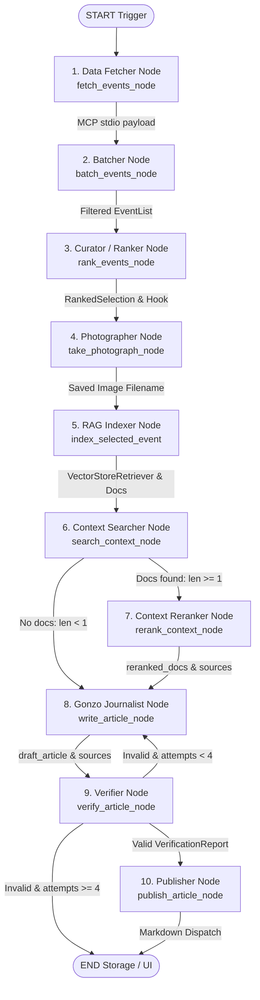

# 🕶️ AGENTS.md — Chrono S. Thompson Multi-Agent Architecture

> **Portfolio Specification** — Detailed technical documentation of the multi-agent system, state transitions, MCP contracts, and prompt engineering protocols driving **Chrono S. Thompson: The Gonzo Historical Correspondent**, built with **LangGraph** and managed with **`uv`**.

---

## 🧭 Executive Overview

Chrono S. Thompson is an autonomous agentic pipeline designed to bridge the temporal disconnect between historical records and contemporary engagement. Instead of treating historical archives as static encyclopedic entries, the architecture orchestrates a stateful multi-step workflow that:

1. **Fetches historical data** via an isolated Model Context Protocol (**FastMCP**) server using `stdio` transport.
2. **Batches & cleans raw events** using LLM structured outputs (Pydantic `EventList`).
3. **Performs editorial curation** using deterministic structured outputs (Pydantic `RankedSelection`), identifying chaotic narrative friction.
4. **Synthesizes visual illustrations** by generating prompt-tailored historical photographs stored in `storage/images/`.
5. **Performs RAG context indexing** by scraping full Wikipedia content, cleaning wikitext noise, attaching source metadata (`title`, `url`, `page_name`), and creating an in-memory `VectorStoreRetriever`.
6. **Searches vector context** querying the vector store retriever with the curated query string to fetch relevant text chunks (`retrieved_docs`).
7. **Validates & re-ranks context** deduplicating, scoring context chunks by keyword density against the selected event and hook, and assigning stable source IDs (`[S1]`, `[S2]`) with metadata (`sources`).
8. **Drafts high-engagement prose** with stable inline citations (`[S1]`, `[S2]`) and a mandatory `### Sources` section formatted with collapsible `<details><summary>` blocks showing canonical URLs and cited excerpts in the visceral voice of Gonzo journalism.
9. **Fact-checks and audits citations** in a dedicated verifier node (`VerificationReport`), checking deterministic citation IDs, missing sources, and supported vs. unsupported/contradicted claims, with a max 4-attempt correction loop.
10. **Persists and archives** verified daily dispatches automatically as Markdown files in `storage/output/`.

---

## 📐 Pipeline & State Graph Flow



---

## 📦 Global Shared State (`ChronoState`)

State transitions are strictly typed in `src/chrono_s_thompson/core/state.py` to enforce zero runtime drift and seamless validation across nodes.

| Attribute | Type | Description |
|---|---|---|
| `target_date` | `str` | Calendar date target in `MM/DD` format. |
| `raw_events` | `List[HistoricalEvent]` | Normalized raw events payload returned by the FastMCP tool. |
| `batched_events` | `EventList` | LLM-filtered structured collection of historical events. |
| `curated_story` | `Optional[RankedSelection]` | Pydantic model representing the selected event and Gonzo hook. |
| `detailed_event` | `Optional[DetailedEvent]` | In-depth historical event details including source URL and page_name. |
| `photo_file_path` | `Optional[FilePath]` | Local filesystem path to the generated photograph image. |
| `photo_filename` | `Optional[str]` | Local filename of the generated photograph image (`storage/images/`). |
| `custom_event` | `Optional[HistoricalEvent]` | User-selected historical event from Streamlit UI override. |
| `retriever` | `Optional[VectorStoreRetriever]` | In-memory vector store retriever built from cleaned Wikipedia content with `Document` metadata. |
| `retrieved_docs` | `List[Any]` | Raw retrieved text documents from the vector store search. |
| `reranked_docs` | `List[Any]` | Deduplicated and relevance-ranked text documents for context synthesis. |
| `draft_article` | `Optional[str]` | Generated dispatch text draft awaiting factual verification. |
| `sources` | `Dict[str, SourceMetadata]` | Mapping of stable source IDs (`S1`, `S2`) to title, URL, page_name, and content snippet. |
| `verification_result` | `Optional[VerificationReport]` | Audit results including validity, missing citation IDs, and claim verification status. |
| `verification_feedback` | `Optional[str]` | Actionable feedback guidelines for article re-drafting when verification fails. |
| `revision_attempts` | `int` | Counter tracking article revision attempts (capped at 4). |
| `final_article` | `Optional[str]` | Verified Gonzo article content formatted in Markdown. |
| `published_path` | `Optional[FilePath]` | Filesystem path of the persisted dispatch (`storage/output/{date}_{title}.md`). |

---

## 🤖 Detailed Agent & Node Specifications

### 1. Data Fetcher Node (`src/chrono_s_thompson/graph/nodes/fetcher.py`)
* **Role:** Subprocess I/O & MCP Tool Orchestration.
* **Mechanism:** Interacts with the local `FastMCP` server over standard I/O (`stdio`), invoking the `get_historical_events` tool.
* **Input State:** `target_date`
* **Output State Mutation:** `{"raw_events": List[HistoricalEvent]}`
* **Failure Guardrail:** Retries according to the node retry policy and returns an error payload in the state for graph error routing.

---

### 2. Event Batcher Node (`src/chrono_s_thompson/graph/nodes/batcher.py`)
* **Role:** Structured Data Filtering & Deduplication.
* **Mechanism:** Passes raw historical events payload into an LLM with `.with_structured_output(EventList)` to structure and prune noisy data.
* **Input State:** `raw_events`
* **Output State Mutation:** `{"batched_events": EventList}`

---

### 3. Curator & Ranker Node (`src/chrono_s_thompson/graph/nodes/ranker.py`)
* **Role:** Editorial Intelligence & Semantic Selection.
* **Mechanism:** Evaluates batched events and enforces schema constraints using `.with_structured_output(RankedSelection)`.
* **Selection Heuristics:**
  * High narrative tension, political chaos, or irony.
  * Strong human drama or breakthrough moments.
  * Formulates a sharp, satirical Gonzo editorial hook.
* **Input State:** `batched_events`, `custom_event` (optional override)
* **Output State Mutation:** `{"curated_story": RankedSelection}`

```python
class RankedSelection(BaseModel):
    selected_event: HistoricalEvent = Field(description="The chosen historical event.")
    gonzo_hook: str = Field(description="The chaotic, urgent, or ironic editorial angle.")
    photo_description: str = Field(description="Visual prompt description for image synthesis.")
    query_string: str = Field(description="Search query for retrieving Wikipedia context.")
```

---

### 4. Photographer Node (`src/chrono_s_thompson/graph/nodes/photographer.py`)
* **Role:** Visual Synthesis & Image Generation.
* **Mechanism:** Constructs a detailed prompt based on the selected event, calls OpenAI image generation, and persists the image locally.
* **Input State:** `curated_story`
* **Output State Mutation:** `{"photo_file_path": FilePath, "photo_filename": str}` (saved to `storage/images/{photo_filename}`)

---

### 5. RAG Indexer Node (`src/chrono_s_thompson/graph/nodes/indexer.py`)
* **Role:** Knowledge Retrieval & Source Metadata Preservation.
* **Mechanism:** Scrapes Wikipedia content for the chosen story, thoroughly cleans wikitext clutter (captions, section titles, unspaced dates), splits text into semantic chunks via `RecursiveCharacterTextSplitter`, attaches `metadata` (`title`, `url`, `page_name`) to each `Document`, and embeds into `VectorStoreRetriever`.
* **Input State:** `curated_story`
* **Output State Mutation:** `{"detailed_event": Dict[str, Any], "retriever": VectorStoreRetriever}`

---

### 6. Context Searcher Node (`src/chrono_s_thompson/graph/nodes/searcher.py`)
* **Role:** Vector Database Retrieval & Context Branching.
* **Mechanism:** Queries the in-memory vector store retriever using `curated_story.query_string` to fetch top matching text chunks.
* **Conditional Routing:** Evaluates retrieved chunks via `route_after_search_context`:
  * If relevant chunks are found (`len(retrieved_docs) >= 1`), routes forward to `rerank_context_node`.
  * If no chunks are retrieved (`len(retrieved_docs) < 1`), bypasses directly to `write_article_node`.
* **Input State:** `curated_story`, `retriever`
* **Output State Mutation:** `{"retrieved_docs": List[Document]}`

---

### 7. Context Reranker Node (`src/chrono_s_thompson/graph/nodes/reranker.py`)
* **Role:** Document Validation, Deduplication & Keyword Scoring.
* **Mechanism:** Validates retrieved documents, removes exact duplicate content, ranks chunks based on keyword density against the selected historical event title and Gonzo hook, and maps top results into stable source IDs (`S1`, `S2`, ...).
* **Input State:** `curated_story`, `retrieved_docs`
* **Output State Mutation:** `{"reranked_docs": List[Document], "sources": Dict[str, SourceMetadata]}`

---

### 8. Gonzo Journalist Node (`src/chrono_s_thompson/graph/nodes/writer.py`)
* **Role:** Creative Narrative Production & Citation Mapping.
* **Mechanism:** Ingests the reranked context and source metadata, assigns stable source IDs (`[S1]`, `[S2]`), and drafts the dispatch adhering to Gonzo style directives and inline citations.
* **Persona Directives:**
  * **First-Person Immersion (Narrative Device):** Report as an eyewitness present at the historical moment. First-person voice is a literary device, NOT eyewitness historical truth. No fabricated historical events or fake dates are allowed.
  * **Citation Requirements:** Inline source tags `[S1]`, `[S2]` and a mandatory `### Sources` section formatted with collapsible HTML `<details><summary>` blocks displaying source title, canonical URL, and cited excerpt snippet.
* **Input State:** `curated_story`, `reranked_docs`, `sources`, `target_date`, `photo_filename`, `verification_feedback` (optional)
* **Output State Mutation:** `{"draft_article": str, "sources": Dict[str, SourceMetadata]}`

---

### 9. Fact Verifier Node (`src/chrono_s_thompson/graph/nodes/verifier.py`)
* **Role:** Citation Verification & Factual Integrity Review.
* **Mechanism:** Performs a deterministic regex citation check for unattached IDs (e.g. `[S99]`) and `### Sources` section presence, followed by an LLM structured claim review (`VerificationReport`).
* **Correction Loop:** If claims are unsupported/contradicted or citations are missing, populates `verification_feedback` and routes back to `write_article` (up to 4 revision attempts).
* **Verification Limitation:** Automated LLM fact-checking is a heuristic analysis layer and does not guarantee absolute historical truth.
* **Input State:** `draft_article`, `sources`, `revision_attempts`
* **Output State Mutation:** `{"verification_result": VerificationReport, "verification_feedback": Optional[str], "revision_attempts": int}`

---

### 10. Publisher Node (`src/chrono_s_thompson/graph/nodes/publisher.py`)
* **Role:** Persistence & Dispatch Archiving.
* **Mechanism:** Ensures `verification_result.is_valid` is True before writing the verified Markdown dispatch to `storage/output/{filename}.md`.
* **Input State:** `draft_article`, `verification_result`, `curated_story`, `photo_file_path`
* **Output State Mutation:** `{"final_article": str, "published_path": FilePath, "photo_file_path": FilePath}`

---

## 🛠️ FastMCP Tool Contracts

The isolated FastMCP server (`src/chrono_s_thompson/mcp_server/server.py`) exposes tools over `stdio`:

### `get_historical_events`
* **Transport:** `stdio`
* **Parameters:** `date` (string, `MM/DD` format)
* **Returns:** JSON serialized array of `HistoricalEvent` objects (`year`, `title`, `page_name`, `category`).

### `get_historical_event_details`
* **Transport:** `stdio`
* **Parameters:** `page_name` (string, Wikipedia page identifier)
* **Returns:** Detailed content object for downstream indexing.

---

## 🧰 Project Execution with `uv`

All execution, dependency management, and testing are handled via **`uv`**:

```bash
# Sync virtual environment dependencies
uv sync

# Run Streamlit control panel
uv run streamlit run app.py

# Run terminal CLI execution
uv run chrono-s-thompson
# Or: uv run python -m src.main

# Run unit and node test suite
uv run pytest

# Test MCP server via inspector
npx @modelcontextprotocol/inspector uv run python -m src.chrono_s_thompson.mcp_server.server
```

---

## 📓 Interactive Jupyter Notebooks (`notebooks/`)

The repository includes dedicated Jupyter notebooks in `notebooks/` for interactive debugging, step-by-step state inspection, and workflow visualization:

1. **`notebooks/test_nodes_step_by_step.ipynb`**:
   - Executes all 10 state graph nodes (`fetch_events` ➔ `batch_events` ➔ `rank_events` ➔ `photographer` ➔ `index_selected_event` ➔ `search_context` ➔ `rerank_context` ➔ `write_article` ➔ `verify_article` ➔ `publish_article`) in sequence.
   - Inspects `ChronoState` data mutations and log outputs at each individual step.

2. **`notebooks/visualize_graph.ipynb`**:
   - Compiles the LangGraph state graph using `build_chrono_graph()`.
   - Renders and displays the Mermaid flow diagram using:
     ```python
     from IPython.display import Image, display

     display(Image(graph.get_graph().draw_mermaid_png()))
     ```

---

## 🔍 Observability & Step-by-Step Tracing (LangSmith)

Step-by-step debugging and visualization of state transitions, node execution times, and LLM prompt/completion payloads are powered natively via **LangSmith**.

To enable tracing, configure the following variables in `.env`:

```env
LANGSMITH_TRACING=true
LANGSMITH_API_KEY=your_langsmith_api_key_here
LANGSMITH_PROJECT=chrono-s-thompson
LANGSMITH_ENDPOINT=https://api.smith.langchain.com
```

### Key Tracing Capabilities:
* **Node-by-Node Execution Inspection:** View input and output `ChronoState` mutations at each step (`fetcher` ➔ `batcher` ➔ `ranker` ➔ `photographer` ➔ `indexer` ➔ `writer`).
* **Structured Output Audit:** Inspect Pydantic schema parsing (`EventList`, `RankedSelection`) for LLM outputs.
* **Latency & Token Telemetry:** Monitor response times and token costs per graph execution.

---

## 🔒 Reliability, Guardrails & Production Standards

* **Deterministic Contracts:** All cross-node state updates strictly enforce Pydantic schemas.
* **Decoupled Architecture:** FastMCP server runs in an isolated stdio process, preventing API/HTTP failures from corrupting state graph execution.
* **Local Offline Translation:** Streamlit dashboard features local translation via Hugging Face Transformers pipeline without external API calls.
* **Portfolio Showcase:** Designed by Eduardo Felipe Machado to highlight end-to-end multi-agent orchestration engineering.