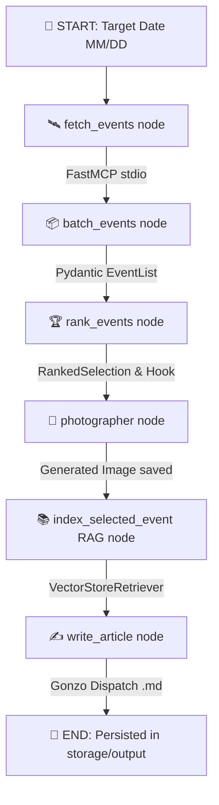

#  Chrono S. Thompson: The Gonzo Historical Correspondent

> **Portfolio Project** — Highlighting modern AI engineering, stateful multi-agent orchestration with **LangGraph**, Model Context Protocol (**FastMCP**), contextual **RAG**, image synthesis, local **Hugging Face** neural translation, and ultra-fast Python environment management with **`uv`**.

---

## 📌 About The Project

**Chrono S. Thompson** is an autonomous agentic pipeline designed to solve the temporal disconnect between static historical archives and modern narrative engagement. Instead of presenting raw encyclopedic entries, the architecture orchestrates a stateful multi-step workflow that:

1. **Fetches historical data** via an isolated Model Context Protocol (MCP) server connected to Wikipedia's "On This Day" archive.
2. **Filters & Batches events** using LLM structured outputs (Pydantic).
3. **Curates & Ranks stories** based on dramatic tension, paradox, and human agency, generating chaotic editorial Gonzo hooks.
4. **Generates historical illustrations** via AI image generation (OpenAI).
5. **Indexes deep context into RAG** by scraping full Wikipedia content and embedding into a vector store retriever.
6. **Drafts high-engagement Gonzo prose** in the authentic, visceral voice of Gonzo journalism (Hunter S. Thompson inspired).
7. **Translates dispatches on-demand** using an offline Hugging Face Transformers pipeline (`Helsinki-NLP/opus-mt-tc-big-en-pt`).
8. **Interactive UI**: Persists, archives, and displays dispatches through a sleek **Streamlit** control panel.

---

## ⚡ Powered by `uv`

This repository strictly uses [**`uv`**](https://github.com/astral-sh/uv), the extremely fast Python package installer and resolver written in Rust. All dependency management, virtual environments, scripts, and build tasks are driven by `uv`.

---

## 🏗️ Architecture Overview



### LangGraph Stateful Pipeline Nodes

1. **Data Fetcher Node (`fetch_events`)**: Interacts with the local FastMCP server via `stdio` (`get_historical_events`).
2. **Event Batcher Node (`batch_events`)**: Cleans and filters historical facts into structured Pydantic `EventList` models.
3. **Curator & Ranker Node (`rank_events`)**: Evaluates narrative friction and selects the main event with a Gonzo editorial angle (`RankedSelection`).
4. **Photographer Node (`photographer`)**: Craft visual prompts and calls OpenAI to generate period-appropriate illustrations saved to `storage/images/`.
5. **RAG Indexer Node (`index_selected_event`)**: Fetches in-depth Wikipedia text, splits into chunks, and builds an in-memory RAG retriever vector store.
6. **Gonzo Journalist Node (`write_article`)**: Synthesizes the RAG context, Gonzo hook, and photograph into a Markdown dispatch saved to `storage/output/`.

---

## 🛠️ Stack & Technologies

* **Language**: Python 3.13+
* **Package Manager & Runner**: [`uv`](https://github.com/astral-sh/uv)
* **Agent Framework**: LangGraph, LangChain Core & LangChain OpenAI
* **Protocol**: FastMCP (Model Context Protocol over `stdio`)
* **Data Validation**: Pydantic v2 & `pydantic-settings`
* **Vector Search / RAG**: LangChain Text Splitters, In-Memory Vector Store
* **Neural Translation**: Hugging Face `transformers` (`Helsinki-NLP/opus-mt-tc-big-en-pt`)
* **Dashboard / UI**: Streamlit
* **Testing**: `pytest`, `pytest-asyncio`

---

## 🚀 Getting Started

### Prerequisites

* Python 3.13+ installed.
* [**`uv`**](https://docs.astral.sh/uv/getting-started/installation/) installed on your machine.
* OpenAI API Key set in your `.env` file (`OPENAI_API_KEY=your_key_here`).

### Installation

1. **Clone the repository**:
   ```bash
   git clone https://github.com/eduardomachado93/chrono-s-thompson.git
   cd chrono-s-thompson
   ```

2. **Sync dependencies with `uv`**:
   ```bash
   uv sync
   ```

3. **Configure environment variables**:
   Create a `.env` file based on `.env.example`:
   ```bash
   cp .env.example .env
   ```
   Fill in your `OPENAI_API_KEY` and optionally enable LangSmith step-by-step tracing (`LANGSMITH_TRACING=true`, `LANGSMITH_API_KEY=...`).

---

## 💻 Running the Application

### 🖥️ Streamlit Web Interface

Launch the interactive control panel with `uv`:

```bash
uv run streamlit run app.py
```

Features included in the web dashboard:
* Custom date selection (`MM/DD`).
* **Random Dispatch**: Automatic execution of the full LangGraph pipeline.
* **Select Event**: Browse fetched historical events and choose which story to generate.
* **Newsroom Archives**: Read all previously generated dispatches.
* **Offline Translation**: One-click translation of dispatches to Portuguese using Hugging Face Transformers.

### >_ Running on terminal

* This will run the application on terminal. You cannot choose a date or a custom event.
* The target date is hardcoded to today's date

```bash
uv run chrono-s-thompson
# Or:
uv run python -m src.main
```

### 🔍 Step-by-Step Debugging with LangSmith

To inspect and debug the LangGraph state transitions, node inputs/outputs, and LLM prompts step-by-step in real-time, configure LangSmith in your `.env` file:

```env
LANGSMITH_TRACING=true
LANGSMITH_API_KEY=your_langsmith_api_key_here
LANGSMITH_PROJECT=chrono-s-thompson
LANGSMITH_ENDPOINT=https://api.smith.langchain.com
```

Once configured, any run of the application (via Streamlit or terminal CLI) will automatically stream execution traces to your [LangSmith Dashboard](https://smith.langchain.com), allowing you to:
* Inspect exact inputs, state mutations, and outputs for every pipeline node (`fetcher`, `batcher`, `ranker`, `photographer`, `indexer`, `writer`).
* Audit structured Pydantic outputs (`EventList`, `RankedSelection`) generated by each LLM step.
* Debug prompt templates, token usage, latency, and model calls across graph executions step-by-step.

### 🔌 Running the MCP Server Inspector

To inspect and test the FastMCP historical server using standard MCP tools:

```bash
npx @modelcontextprotocol/inspector uv run python -m src.chrono_s_thompson.mcp_server.server
```

### 🧪 Running Tests

Run unit tests across graph nodes and MCP client via `uv`:

```bash
uv run pytest
```

---

## 📂 Project Structure

```
chrono-s-thompson/
├── app.py                      # Streamlit Control Panel Interface
├── pyproject.toml              # Project metadata & dependencies (uv build)
├── uv.lock                     # Deterministic dependency lock file
├── avatar.svg                  # Chrono S. Thompson Avatar Logo
├── src/
│   └── chrono_s_thompson/
│       ├── core/               # State schemas (ChronoState) & Translation utilities
│       ├── graph/              # LangGraph workflow builder, nodes & prompts
│       │   ├── nodes/          # fetcher, batcher, ranker, photographer, indexer, writer
│       │   └── prompts/        # System prompts & Gonzo style directives
│       ├── mcp_client/         # Client interface for MCP stdio transport
│       └── mcp_server/         # FastMCP historical data server & Wikipedia tools
├── storage/
│   ├── images/                 # Generated dispatch historical illustrations
│   └── output/                 # Persisted Gonzo dispatches (.md)
└── tests/                      # Pytest suite for nodes and MCP components
```

---

## 👤 Author & Portfolio Context

Developed by **Eduardo Felipe Machado** as part of an advanced AI Engineering portfolio demonstrating agentic workflows, MCP server design, RAG pipelines, and modern Python tooling (`uv`).

* **GitHub**: [@eduardomachado93](https://github.com/eduardomachado93)

---

## 📜 License

No license has been explicitly declared for this project.